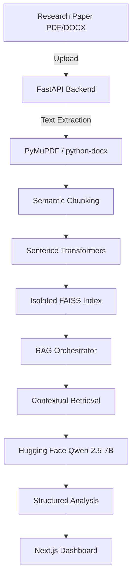

# AI Research Paper Explainer

**Deep Insights & Semantic Understanding for Academic Research**

## Overview

**AI Research Paper Explainer** is a production-oriented platform that helps researchers and developers understand complex academic papers using a specialized **Retrieval-Augmented Generation (RAG)** pipeline.

Instead of generic summarization, the system:
- **Partitions** research documents into semantic chunks.
- **Generates** high-fidelity embeddings using `all-MiniLM-L6-v2`.
- **Retrieves** relevant context for multi-step reasoning.
- **Extracts** structured technical insights (Models, Datasets, Techniques, Metrics).

This approach ensures that even long, data-heavy research papers are explained with high precision and technical accuracy.

---

## Core Capabilities

- **Automated Research Summarization**: Multi-step LLM chain for TL;DR, Methodology, and Results.
- **Key Contributions Extraction**: Focused retrieval to identify exactly what a paper adds to the field.
- **Technical Entity Discovery**: Automatic identification of Models, Datasets, Algorithms, and Performance Metrics.
- **Semantic Search**: Ask questions directly to the document using vector similarity search.
- **Multi-Format Support**: Native processing for both `.pdf` and `.docx` research documents.
- **Isolated Vector Storage**: Paper-centric FAISS indices for efficient data management and privacy.
- **Modern Responsive UI**: Premium Next.js dashboard with dark mode and interactive sections.

---

## Architecture

### System Flow


The architecture separates the **Ingestion Pipeline** (chunking/embedding), the **Vector Store** (FAISS), and the **Reasoning Layer** (Hugging Face Inference Router). This ensures low latency and high scalability.

---

## Demo

### Working Model Preview

*A preview of the AI Research Paper Explainer processing a document and generating technical insights.*

---

## Engineering Decisions & Design Rationale

### Why Paper-Centric FAISS?
Instead of a single massive index, the system uses isolated FAISS indices per paper. This prevents context bleed between different research topics and allows for rapid, focused retrieval within a single document's context.

### Why Qwen-2.5-7B via Unified Router?
Academic text is dense and requires a model with strong logical reasoning and technical vocabulary. Qwen-2.5 offers superior performance on instruction following and JSON-like structuring compared to other serverless models on the Hugging Face tier.

### Robust Insight Extraction Strategy
To handle the inherent variability in LLM responses (markdown artifacts, varying JSON keys), the system uses a hardened text-based tagging and regex parsing strategy. This ensures that "Models", "Datasets", and other entities are extracted even if the model's formatting fluctuates.

---

## Tech Stack

- **Frontend**: Next.js, React, Lucide Icons, Vanilla CSS
- **Backend API**: FastAPI, Uvicorn, Pydantic
- **AI/ML Layer**: Hugging Face Inference API (Qwen-2.5-7B), Sentence-Transformers, FAISS
- **Processing**: PyMuPDF, python-docx, NumPy

---

## Project Structure

```text
ai-research-paper-explainer/
├── frontend/             # Root Directory for Vercel
│   ├── api/              # Vercel Serverless Entry Points (Python)
│   ├── backend/          # FastAPI & Content Extraction Logic
│   ├── src/app/          # Next.js Pages & Layouts
│   └── requirements.txt  # Python Dependencies
├── data/                 # Local data storage
├── assets/               # Demo Media
└── README.md             # Project Info
```

---

## Vercel Deployment & Optimization (Production-Ready)

This repository is optimized for **Zero-Config Vercel Deployment** with several hardened engineering decisions:

1. **Serverless Timeout Optimization**: Instead of a monolithic processing request, the frontend decouples document uploading from analysis. It fetches Summary, Insights, and Graphs in parallel. This prevents Vercel's strict Hobby timeouts (10s) and ensures a fast, resilient user experience.
2. **Native Asset Routing**: Uses a custom `vercel.json` to route all `/api/*` requests directly to the Python serverless environment.
3. **Security Compliance**: Locked to **Next.js 15.2.0** to resolve specific CVE blocks required by Vercel's automated security scans.

### Deployment Steps:
1. In the Vercel Dashboard, import this repository.
2. **Important:** Set the **Root Directory** to `frontend`.
3. Add your `HUGGINGFACE_API_KEY` to your Vercel Environment Variables.
4. Deploy! 

## Local Development

You can run both Next.js and the Python API natively together using the following steps:

```bash
# 1. Update/Install dependencies
cd frontend
npm install

# 2. Run the development environment
npm run dev
```
*(Ensure you have a `.env` in the `frontend` directory with your Hugging Face API key).*

3. **Configuration**:
Ensure you have a `.env` file in the root with your `HUGGINGFACE_API_KEY`.

---

## What This Project Demonstrates
- High-fidelity RAG architecture for technical document analysis.
- Designing resilient LLM integrations on serverless inference tiers.
- Building beautiful, developer-focused React interfaces for AI tools.
- Clean Code in Python, adhering to modern FastAPI best practices.